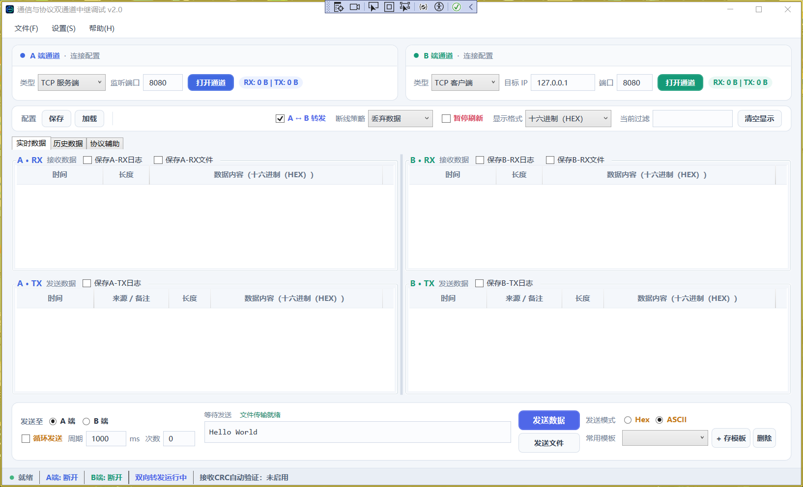

# WpfProtocolStudio

WpfProtocolStudio 是一个面向串口、网络和 CAN 通信场景的双通道调试工具。程序把两个通信端抽象为 A、B 两个通道，两端可以使用不同的通信方式，也可以在打开后进行透明转发。

这个项目最初用于解决日常联调中几个反复出现的问题：串口工具和网络工具需要来回切换、收发数据不方便对照、长时间运行后界面越来越卡，以及协议数据需要人工拆帧、计算 CRC 和查表解析。现在这些功能统一放在一个界面里，既可以当普通串口助手使用，也可以作为两个设备之间的中继和协议观察工具。

## 快速访问目录

- [当前版本](#当前版本)
- [支持的通道类型](#支持的通道类型)
- [界面功能详解](#界面功能详解)
  - [顶部菜单](#1-顶部菜单)
  - [A、B 通道配置区](#2-ab-通道配置区)
  - [全局控制栏](#3-全局控制栏)
  - [实时数据页](#4-实时数据页)
  - [历史数据页](#5-历史数据页)
  - [数据分帧](#6-协议辅助数据分帧)
  - [CRC 计算与接收自动验证](#7-协议辅助crc-计算与接收自动验证)
  - [协议解析插件](#8-协议辅助解析插件)
  - [底部发送区](#9-底部发送区)
  - [状态栏](#10-状态栏)
- [常见使用流程](#常见使用流程)
- [日志说明](#日志说明)
- [编译与运行](#编译与运行)
- [项目结构](#项目结构)
- [使用注意事项](#使用时需要留意的几点)

## 当前版本

- `v1` 分支保存一期版本，包含双通道通信、转发、实时显示、日志、历史搜索和文件收发等基础功能。
- `main` 分支为当前 V2，增加数据分帧、CRC 辅助与接收自动验证、协议解析插件等功能。
- 程序基于 .NET Framework 4.8，仅支持 Windows。

## 支持的通道类型

| 通道类型 | 可配置内容 | 说明 |
| --- | --- | --- |
| 串口 | COM 口、波特率、数据位、停止位、校验位 | 波特率最高可选 921600 |
| TCP 服务端 | 本地监听端口 | 等待客户端连接后收发数据 |
| TCP 客户端 | 目标 IP、目标端口 | 主动连接远端服务 |
| UDP | 本地端口、目标 IP、目标端口 | 本地监听与远端发送地址分别设置 |
| CAN | 驱动、设备类型、设备索引、CAN 通道、波特率、过滤 ID、发送 ID | 使用 ControlCAN 兼容驱动，需要真实设备及对应 DLL |

A、B 两端可以自由组合，例如串口转 TCP、TCP 转 UDP、串口转串口，或者一端使用 CAN、另一端使用网络。

## 界面功能详解

主界面按照实际调试顺序从上到下排列：先配置 A、B 两个通道，再决定是否开启双向转发，随后观察实时数据或查询历史日志，最下方负责主动发送数据和文件。协议分帧、CRC 校验及插件解析集中放在“协议辅助”页，不会挤占日常收发数据的空间。

界面中的蓝色代表 A 端，绿色代表 B 端。`RX` 表示从该通道接收到的数据，`TX` 表示由该通道发出的数据。调试时只要记住这组颜色和方向，查看转发链路会比较直观。

### 1. 顶部菜单

“文件”菜单主要处理日志和通道配置：

- **保存日志**：将当前界面中的收发记录导出到指定位置。
- **自动保存日志**：打开后，程序把新产生的日志放入后台队列写入文件；默认关闭。
- **保存通道配置 / 加载通道配置**：保存或恢复两端的通信参数与转发设置。

“设置”菜单用于指定保存位置和格式：

- **选择文件保存文件夹**：A-RX 与 B-RX 共用一个接收文件目录，文件名前缀用于区分来源。
- **选择日志保存格式**：可单独启用 TXT、CSV、BIN。
- **选择自动保存日志文件夹**：自动日志开启后使用该目录。
- **清空显示记录**：清空四个实时列表，但不会关闭通道，也不会清除已经保存到磁盘的文件。

### 2. A、B 通道配置区

A 端使用蓝色标识，B 端使用绿色标识。选择通道类型后，界面只显示当前类型需要的参数，避免把串口、网络和 CAN 参数全部堆在一起。

点击“打开通道”后：

- 按钮会变成红色，提示当前通道处于打开状态；
- 再次点击可关闭通道，按钮恢复原色；
- 修改已打开通道的关键连接参数时，程序会先安全关闭旧连接，避免界面参数与实际连接不一致。

通道旁边的 `RX / TX` 数字表示累计收发字节数。这个区域本身也是按钮，点击后可以单独清零当前通道的统计，不会清空实时数据记录。

### 3. 全局控制栏

通道配置下方是两个通道共用的控制项：

- **A ↔ B 转发**：控制透明中继。关闭后，两端仍然可以独立接收和主动发送，只是不再自动把一端收到的数据转给另一端。
- **断线策略**：
  - `丢弃数据`：目标端断开时不缓存待转发数据；
  - `缓存补发`：在有界队列内保存数据，目标端恢复后补发；
  - `暂停转发`：检测到目标端异常后停止中继。
- **暂停刷新**：停止界面刷屏，不停止底层接收、透明转发、文件接收和后台日志。
- **显示格式**：支持十六进制、ASCII、HEX + ASCII 和二进制。
- **当前过滤**：对实时记录中的 HEX、ASCII、二进制、时间和备注进行关键字过滤。
- **清空显示**：清空当前四个方向的显示数据。

显示格式采用“记录快照”方式：切换格式后，只影响后续收到的数据，之前的记录仍保持当时的显示形式。这样可以在同一次调试中先观察 HEX，再切换到 ASCII，而不会把整个历史列表重新解释一遍。

### 4. 实时数据页



上图是一组常见的 TCP 中继配置：A 端作为 TCP 服务端监听 `8080`，B 端作为 TCP 客户端连接 `127.0.0.1:8080`。两端打开后，勾选“A ↔ B 转发”即可建立双向数据通路。这里使用本机回环地址只是为了演示，连接真实设备时应改成设备所在网络的实际地址。

页面中间按照方向分成四块：左侧属于 A 端，右侧属于 B 端；上半部分是接收，下半部分是发送。例如数据从 A 端进入并被转发到 B 端时，可以同时在 `A-RX` 和 `B-TX` 中核对内容、长度和时间。反方向的数据则对应 `B-RX` 与 `A-TX`。

实时页分为四个区域：

| 区域 | 含义 |
| --- | --- |
| A-RX | A 端实际接收到的数据 |
| A-TX | A 端主动发送或中继发送的数据 |
| B-RX | B 端实际接收到的数据 |
| B-TX | B 端主动发送或中继发送的数据 |

四个区域之间有分割器，可以根据当前关注方向调整大小。表格支持横向和纵向滚动；数据很长时不会在每一行内部生成单独滚动条，而是由列表底部统一横向滚动。

每个方向的记录都进入有界显示缓冲区。记录数量达到上限后，最旧的数据会被移除，避免长时间运行时内存无限增长。界面刷新采用批量处理，底层接收和 UI 更新彼此分离。

A-RX、B-RX 标题旁还提供两个独立选项：

- **保存 RX 日志**：保存带时间、方向、长度、内容和备注的结构化记录；
- **保存 RX 文件**：把接收到的文件数据写入“设置”中指定的共用文件夹。

日志和原始文件不是同一种东西。日志适合查看通信过程，原始文件用于尽量保留收到的二进制内容。

底部发送区在三个功能页中始终保留，因此切换到历史数据或协议辅助页后仍可继续发送。截图中选择的是 A 端和 ASCII 模式，点击“发送数据”后，`Hello World` 会通过 A 通道发出；如果启用了转发，收到的数据仍会按照当前链路规则继续传递。

### 5. 历史数据页


历史数据页不直接搜索当前实时列表，而是读取已经保存到磁盘的日志。先点击“选择日志文件”，可以一次选择一个或多个 TXT、CSV、BIN 文件；文件路径会显示在左侧长输入框中。然后在右侧填写关键字并点击“搜索”，结果会统一列在下方表格中。

结果表将同一条记录拆成文件、时间、方向、所属端、长度、HEX、ASCII 和备注几个字段，既方便核对原始字节，也方便直接阅读文本内容。搜索完成后，底部提示会显示扫描数量和命中数量；“清空结果”只清除本次查询结果，不删除选中的日志文件。

历史数据页用于搜索已经落盘的 TXT、CSV 或 BIN 日志：

1. 选择一个或多个历史日志文件；
2. 输入关键字；
3. 点击搜索；
4. 在结果中查看时间、方向、长度、HEX、ASCII 和备注。

搜索放在后台执行，结果数量也有限制，避免一次载入超大日志导致界面失去响应。关键字为空时可以用于浏览选中文件中的记录。

### 6. 协议辅助：数据分帧


协议辅助页分为三个功能区域：最上方是数据流分帧，左下方是 CRC 校验计算，右下方是协议解析插件。它们既可以分开使用，也可以串联起来：收到连续字节后先按规则组成完整帧，再验证帧尾 CRC，校验通过的正文最后交给解析插件转换成业务字段。

截图中的分帧方式是“按接收块（不重分帧）”，表示暂时沿用底层每次接收的数据块。切换为固定长度、分隔符或时间间隔后会立即生效，执行结果仍显示在“实时数据”页对应的 A-RX、A-TX、B-RX、B-TX 区域，不会在协议辅助页另建一份重复列表。

串口和 TCP 提供的是连续字节流，一次底层回调不一定等于一帧协议数据。协议辅助页提供四种显示方式：

- **按接收块（不重分帧）**：保持底层每次收到的数据块；
- **固定长度**：例如长度设置为 8，每 8 字节生成一条显示记录；
- **分隔符**：遇到指定 HEX 或文本分隔符时生成一帧，分隔符保留在帧尾；
- **时间间隔**：连续一段时间没有新字节时，把当前缓存作为一帧输出。

切换分帧方式后立即生效，不需要再点击“应用”。修改当前方式对应的参数后，输入框失去焦点时自动更新。

分隔符模式和固定长度模式都有空闲时间兜底。例如设置分隔符 `0D 0A`，但本次数据中没有出现该字节序列，缓存会在达到“空闲间隔”后自动输出，不会一直隐藏。也可以点击“输出剩余数据”立即输出当前尾部缓存。

需要特别区分 HEX 与文本：

```text
HEX 01   = 一个字节 0x01
文本 01  = 两个字符，实际字节为 0x30 0x31
```

分帧结果显示在原来的 A-RX、A-TX、B-RX、B-TX 区域。分帧只改变界面观察和后续协议解析的帧边界，不修改透明转发、原始日志和文件内容。

### 7. 协议辅助：CRC 计算与接收自动验证

CRC 区域保留手动计算功能，可以输入 HEX 或文本并选择：

- CRC16 / MODBUS；
- CRC16 / CCITT-FALSE；
- CRC32 / ISO-HDLC。

“计算校验值”会同时给出 CRC 数值和线上应使用的字节序。“验证报文末尾”用于输入一条包含 CRC 的完整 HEX 报文，程序会自动分离正文与末尾校验值并比较。

以截图中的 `01 03 00 00 00 02` 为例，选择 `CRC16 / MODBUS` 后点击“计算校验值”，下方会显示计算结果和发送时应采用的字节顺序。如果手里已经有一整条带 CRC 的报文，可以直接粘贴后点击“验证报文末尾”，用来判断设备给出的校验值是否正确。

接收自动验证的使用方法：

1. 先选择合适的分帧规则，确保 A-RX 或 B-RX 中的一条记录就是一帧完整报文；
2. 选择 CRC 算法；
3. 根据设备协议选择是否“高字节在前”；
4. 勾选“自动校验接收 CRC”；
5. 根据需要勾选“丢弃错误帧（显示/解析）”。

自动验证只处理 A-RX、B-RX，不对 A-TX、B-TX 重复验证。正确帧以浅绿色背景显示，错误帧以浅红色背景显示；界面底部会累计 CRC 正确帧数和错误帧数。

字节序必须与设备一致。例如正文 `31 31 20` 的 CRC16/MODBUS 数值为 `0x4734`：

```text
低字节在前：34 47（标准 Modbus RTU 常用）
高字节在前：47 34
```

“丢弃错误帧”当前只表示不在实时列表中显示、不送入协议插件。透明中继和原始日志仍保留收到的数据，因为这个工具首先要保证中继链路可观察，不能在未明确授权时悄悄改变线上数据。

CRC 正确时，程序会剥离末尾 CRC，再把有效正文交给协议解析插件。

### 8. 协议辅助：解析插件

插件功能用于把原始字节转换成业务字段。程序内置“通用字节解析”，可以显示长度、HEX、ASCII、首字节和尾字节；真正的设备协议可以通过外部 DLL 扩展。

截图右侧显示当前只加载了内置的“通用字节解析”。将自定义 DLL 放入插件目录后，点击“重新加载插件”，扫描结果会直接显示在解析器下方；加载成功的解析器会出现在下拉列表中。“打开插件目录”用于快速定位程序实际扫描的位置，“实时解析”则决定接收到的新帧是否自动进入所选解析器。

手动解析：

1. 选择解析器；
2. 输入 HEX 或文本；
3. 点击“解析数据”；
4. 在下方查看字段结果。

实时解析：

1. 先配置分帧；
2. 选择需要使用的解析器；
3. 勾选“实时解析”；
4. 分帧后的数据会进入后台解析队列；
5. 解析结果显示时间、方向、解析器名称和业务字段。

解析任务不会直接阻塞通信线程，队列和结果列表都有数量上限。单个插件发生异常时会产生一条错误结果，不会中断通道。

外部插件加载流程：

1. 点击“打开插件目录”；
2. 将插件 DLL 放入程序目录下的 `Plugins` 文件夹；
3. 点击“重新加载插件”；
4. 顶部状态会显示扫描的 DLL 数量、成功加载数量或具体错误；
5. 成功后，插件会出现在解析器下拉框中。

程序采用内存加载方式，不会长期锁住 `Plugins` 中的原始 DLL。运行期间可以替换插件文件，再次点击重新加载。

插件项目需要使用 .NET Framework 4.8，引用 `WpfProtocolStudio.exe`，实现 `IProtocolParser` 并提供公共无参构造函数：

```csharp
using WpfProtocolStudio.Interfaces;
using WpfProtocolStudio.Models;

public sealed class DeviceStatusParser : IProtocolParser
{
    public string Name => "设备状态协议";
    public string Description => "解析温度、电压和设备状态";

    public bool CanParse(byte[] data)
    {
        return data != null && data.Length >= 4 && data[0] == 0xAA;
    }

    public ProtocolParseResult Parse(byte[] data)
    {
        var result = new ProtocolParseResult
        {
            Success = true,
            Summary = "设备状态解析完成"
        };
        result.Fields["温度"] = (data[1] / 10.0).ToString("0.0") + " ℃";
        result.Fields["电压"] = (data[2] / 10.0).ToString("0.0") + " V";
        result.Fields["状态"] = data[3] == 0 ? "正常" : "异常";
        return result;
    }
}
```

插件开发的简要说明也会随程序复制到 `Plugins/README.md`。

### 9. 底部发送区

发送区可以选择 A 端或 B 端作为目标，支持 HEX 与 ASCII 两种输入方式。

发送操作从左到右依次是目标通道、循环参数、发送内容、发送按钮和发送模式。常用报文可以保存为模板，减少反复输入；发送文件则走独立的文件传输流程，并在输入框上方显示准备、发送进度或完成状态。

- **HEX 发送**：每两个十六进制字符表示一个字节，支持空格分隔；
- **ASCII 发送**：按照文本编码发送；
- **循环发送**：支持周期、次数设置，次数为 0 表示持续发送；
- **常用模板**：保存当前发送内容和发送格式，之后可直接选择；
- **发送文件**：使用带文件名、长度和 SHA-256 的文件传输格式发送，接收端运行本工具时可以恢复并校验完整文件。

发送框不会自动追加 CRC。当前版本按照中继调试工具的定位，将 CRC 作为接收验证和协议诊断功能；如果设备要求发送报文本身包含 CRC，应在发送内容或报文模板中提供完整字节。

文件发送不会经过文本分帧或 CRC 追加逻辑，避免修改原文件内容。发送文件期间会暂时停止透明转发，防止其他转发数据插入文件正文。

### 10. 状态栏

窗口底部集中显示：

- A 端连接状态；
- B 端连接状态；
- 当前透明转发状态；
- 接收 CRC 正确帧数和错误帧数。

CRC 统计可以在协议辅助页单独重置，不会影响通道 RX/TX 字节统计。

## 常见使用流程

### 串口与 TCP 之间做透明中继

1. A 端选择串口并设置 COM、波特率等参数；
2. B 端选择 TCP 服务端或客户端并设置端口；
3. 分别打开两个通道；
4. 勾选“A ↔ B 转发”；
5. 在 A-RX、B-TX 或 B-RX、A-TX 中对照转发情况。

### 验证设备返回的 Modbus CRC

1. 按协议设置固定长度、分隔符或时间间隔分帧；
2. CRC 算法选择 `CRC16 / MODBUS`；
3. 标准 Modbus RTU 通常不勾选“高字节在前”；
4. 勾选“自动校验接收 CRC”；
5. 正确帧显示为绿色，错误帧显示为红色，底部同时更新统计。

### 接收文件

1. 在“设置”中选择 A-RX、B-RX 共用的文件保存文件夹；
2. 在需要接收文件的方向勾选“保存 RX 文件”；
3. 使用本工具发送文件时，接收端可以获得文件名、长度和 SHA-256 信息；
4. 来自普通串口助手或网络助手的裸数据没有文件名和结束标记，程序只能根据接收突发与内容特征保存，是否可直接打开取决于发送端是否完整、连续地发送了原文件字节。

## 日志说明

结构化 TXT 日志使用类似下面的格式：

```text
[2026-08-10 13:35:48.246] [Rx] [ChannelA] [21B] HEX: 57 65 6C 63 6F 6D 65 | ASCII: Welcome | 备注: COM2
```

不同格式的用途：

- **TXT**：适合人工阅读和问题追踪；
- **CSV**：适合使用 Excel 筛选和统计；
- **BIN**：保存结构化二进制日志数据，不等同于接收文件的原始副本。

如果目标是原样保留文件，应使用“保存 A-RX 文件 / 保存 B-RX 文件”，不要把 BIN 日志当成源文件。

## 编译与运行

### 环境要求

- Windows 10 或 Windows 11；
- Visual Studio 2019/2022；
- 安装“.NET 桌面开发”工作负载；
- .NET Framework 4.8 Targeting Pack。

### 编译步骤

```powershell
git clone https://github.com/2024superliu/ProtocolStudio.git
cd ProtocolStudio
```

用 Visual Studio 打开 `WpfProtocolStudio.sln`，选择 `Debug` 或 `Release`，然后执行“重新生成解决方案”。默认输出位于：

```text
bin\Debug\WpfProtocolStudio.exe
bin\Release\WpfProtocolStudio.exe
```

CAN 功能还需要设备厂商提供的 ControlCAN 兼容驱动。没有 CAN 硬件时，可以正常使用串口、TCP 和 UDP 功能，但不能仅靠软件模拟出真实 CAN 总线电气行为。

## 项目结构

```text
WpfProtocolStudio/
├── Channels/       串口、TCP、UDP、CAN 通道实现
├── Engine/         双通道透明转发与断线策略
├── Enums/          通道、显示、分帧、CRC 等枚举
├── Events/         收发、转发事件参数
├── Helpers/        WPF 转换器、命令与列表辅助功能
├── Interfaces/     通信通道和协议解析插件接口
├── Models/         实时记录、历史记录、解析结果等模型
├── Plugins/        外部协议解析插件目录及开发说明
├── Services/       日志、分帧、CRC、文件传输、插件加载等服务
├── ViewModels/     主界面状态与业务逻辑
├── MainWindow.xaml 主界面布局
└── WpfProtocolStudio.sln
```

## 使用时需要留意的几点

- 自动 CRC 验证依赖完整帧；分帧规则不正确时，CRC 结果也不会可靠。
- CRC 算法相同不代表字节序相同，必须以设备协议文档为准。
- “暂停刷新”不是暂停通信；需要停止中继时应关闭“A ↔ B 转发”。
- “丢弃 CRC 错误帧”只影响显示和协议解析，不影响透明转发及原始日志。
- 文本分隔符和 HEX 分隔符代表的字节可能完全不同。
- 长时间运行时界面只保留最近的有限数量记录，完整追踪应同时开启日志。

## 维护者

[2024superliu](https://github.com/2024superliu)
